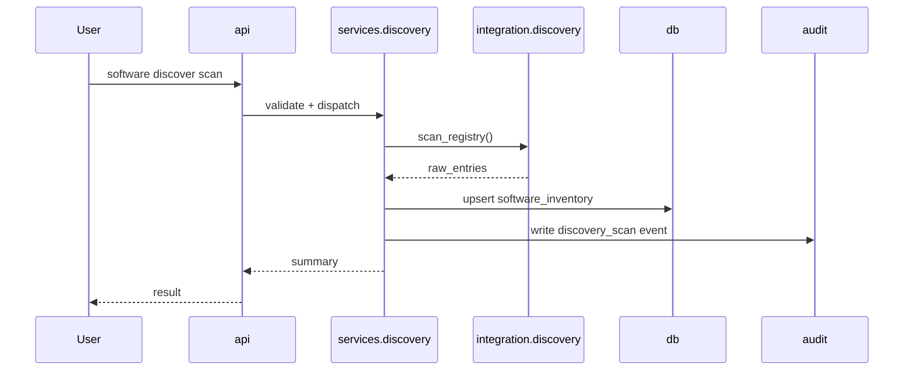
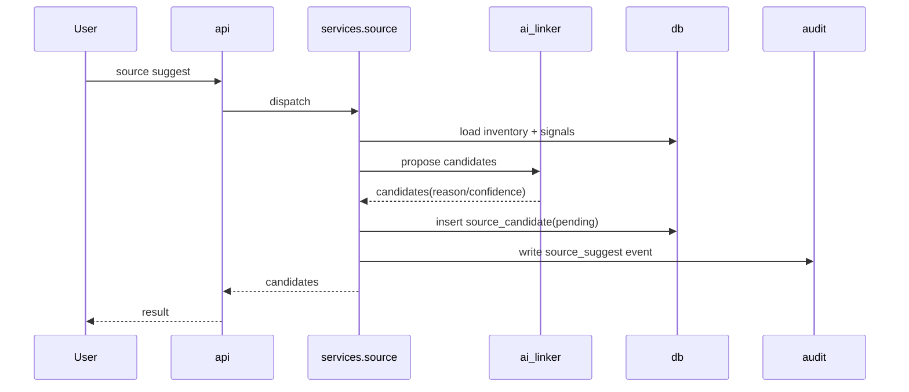
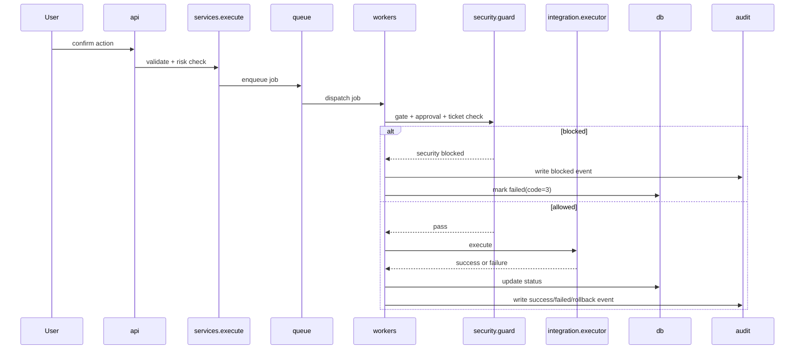
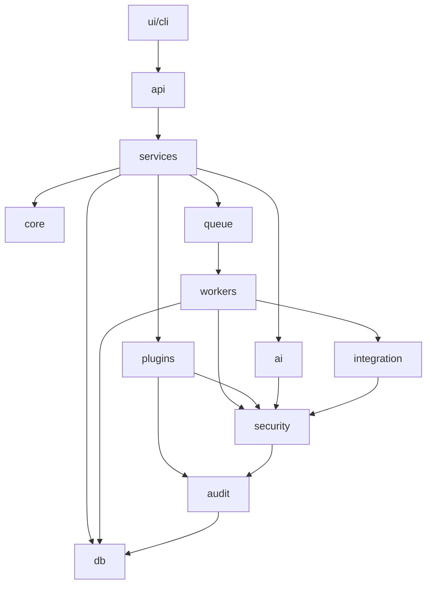

# ARCHITECTURE

## 文档目的
定义 Synora 的系统结构、模块边界、关键数据流与失效语义，作为实现与测试的上游设计输入。

## 当前状态
- 状态：v0.3 Draft（继续设计中，未冻结）
- 架构范围：Windows + CLI-first + Local-first
- 已拍板输入：Discovery MVP 采用 Registry-only

## 上下文输入
- 产品定位：AI 驱动的软件操作系统管理器（本地优先）
- 安全原则：默认安全、显式确认、可审计、可回滚
- 当前阶段目标：形成可编码的架构草图，但保留变更空间

## 预期输出
- 明确模块职责与依赖方向
- 明确关键业务流程（发现、补链、执行、审计）
- 明确安全门禁在链路中的位置
- 明确后续 Phase 2 扩展点

## 系统总览（Draft）

```text
UI Layer (CLI now, GUI later)
  -> API Layer
    -> Service Layer
      -> Worker Layer
      -> Core/Domain Layer
        -> Security + Audit + Contracts
          -> Storage Layer (SQLite + config)
          -> Integration Layer (WinGet / Registry / Signature checker / AI / Plugins)
```

说明：
- UI 只做交互，不做业务与状态机。
- API 统一命令/请求入口，负责参数契约与输出契约。
- Service 编排业务与任务拆分，不直接处理长耗时流程。
- Worker 专门执行异步任务（扫描/下载/更新/修复执行）。
- Storage 负责持久化、队列状态与审计查询。

## 代码结构基线（Draft）

```text
src
 ├ api
 ├ core
 ├ services
 ├ workers
 ├ queue
 ├ scheduler
 ├ plugins
 ├ ai
 ├ integration
 ├ security
 ├ audit
 ├ db
 └ contracts
```

说明：
- `queue`：任务入队/出队/重试/死信逻辑。
- `scheduler`：定时触发器（更新检查、定期扫描）。
- `contracts`：DTO、错误码、状态枚举统一定义。
- 任务类型与 payload 契约见：`docs/JOB_TYPES_DRAFT.md`。
- 重试与死信策略见：`docs/JOB_RETRY_POLICY_DRAFT.md`。
- 任务运维手册见：`docs/JOB_OPERATIONS_PLAYBOOK.md`。
- 下载来源策略见：`docs/DOWNLOAD_SOURCE_POLICY_DRAFT.md`。
- 下载缓存策略见：`docs/DOWNLOAD_CACHE_POLICY_DRAFT.md`。
- Sandbox 执行策略见：`docs/SANDBOX_EXECUTION_POLICY_DRAFT.md`。
- Hash 与签名策略见：`docs/HASH_AND_SIGNATURE_POLICY_DRAFT.md`。

## 模块职责（Draft）

1. `api`
- 命令解析、参数校验、退出码映射
- 输出模式：plain / json / verbose

2. `services`
- 用例编排：discover、list、suggest、update、cleanup、gate 管理
- 负责把长任务提交到队列

3. `security`
- 风险分级与确认策略（high risk 必须 confirm）
- 真实变更门禁（real_mutation_enabled + approval record）
- 路径遍历/来源白名单/签名校验策略

4. `db`
- 本地配置读写（`config.json`）
- SQLite 数据存储（inventory、queue、audit、gate history）
- 查询过滤与分页/limit 支持

5. `workers`
- 负责异步执行扫描、下载、更新、修复执行任务
- 消费队列并回写任务状态与审计

6. `queue`
- 任务生命周期：`queued -> running -> success/failed/retry/deadletter`
- 支持优先级、最大重试次数与错误摘要

7. `scheduler`
- 触发定时任务入队（如每日更新检查）
- 支持启停与任务模板

8. `integration.discovery`
- MVP: Registry-only 扫描（HKLM/HKCU uninstall）
- Phase 2: Program Files / Start Menu / Portable 扩展

9. `integration.package_manager`
- 与 winget 等包管理器交互
- 在 MVP 可先保留模拟执行模式

10. `integration.download`
- 下载执行（HTTP/HTTPS）与文件落盘
- 产物哈希校验与来源校验入口
- 下载失败回写队列与审计

11. `ai`（包含 `ai_linker` 与 `ai_assistant`）
- 基于本地 inventory 与规则/模型输出来源候选链接
- 支持 analyze/recommend/repair_plan
- 仅输出候选或计划，不可直接触发安装/修复执行

12. `plugins`（plugin runtime + manifest validator）
- 管理插件清单、加载状态、权限声明与执行入口
- 支持插件类型：`source_provider`、`update_policy`、`ai_tool`、`system_tool`
- 所有插件调用必须经过 `security` 与 `audit` 包装

13. `audit`
- 提供统一审计写入入口，避免分散写表
- 统一事件结构与严重级别

14. `contracts`
- 统一共享状态词汇、错误码与传输对象

15. `integration.repository`
- 仓库注册与同步（公共/个人）
- 软件条目解析与校验（`software.yaml`）
- 提供仓库检索与来源分发入口

## 核心数据流（Draft）

### Flow A: 软件自动发现（MVP）
1. 用户触发 `software discover scan`
2. Service 调用 `integrations.discovery` 扫描 Registry
3. Service 对结果做规范化与去重（同名/同发布商粗粒度）
4. 写入 `software_inventory`，并写审计事件 `discovery_scan`
5. 返回扫描统计（新增/更新/跳过）

### Flow B: AI 来源补链
1. 用户触发 `source suggest`
2. Service 读取 inventory + 更新信号
3. AI linker 输出候选来源（含置信度、理由、来源域名）
4. 候选写入 `source_candidate`
5. 返回候选列表，默认 pending 状态

### Flow C: 高风险执行（cleanup / update）
1. 用户触发 confirm 执行
2. API 进入 Service，生成 job 并入队
3. Worker 取任务前执行 Guard 校验（风险级别、gate、approval、ticket）
4. 未通过：任务失败并写审计
5. 通过：进入模拟/真实执行器
6. 回写任务状态并写审计（success / failed / rollback）

### Flow H: 下载任务（Draft）
1. 用户触发下载（或由更新流程触发）
2. Service 创建 `download.fetch` 任务入队
3. Worker 调用 `integration.download` 执行下载
4. 下载完成后执行校验（hash/来源）
5. 校验成功写 `download_artifact`，失败写错误并阻断后续安装
6. 写 `download_task_history` 与 `audit_event`

### Flow I: 软件仓库同步与检索（Draft）
1. 用户触发仓库同步或检索命令
2. Service 调用 `integration.repository` 拉取仓库索引
3. 解析 `software.yaml` 并执行字段校验（必填项、URL 格式、来源策略）
4. 写入仓库条目表与版本快照
5. 检索时按仓库优先级聚合返回（personal > trusted public）
6. 写审计事件（sync/search/import/export）

### Flow D: 插件调用（Draft）
1. 用户触发插件相关命令（list/enable/disable/run）
2. Service 向 Plugin Runtime 请求 manifest 与权限
3. Security Guard 校验插件信任状态与请求能力
4. 通过后执行插件 action（只允许声明内能力）
5. 写入 `plugin_execution_history` 与 `audit_event`

### Flow E: AI 软件整理分析（Draft）
1. 用户触发 AI 分析命令
2. Service 汇总 inventory 与更新信号（短任务可同步，长任务可入队）
3. AI Assistant 输出分类、冗余与建议项
4. 写入 `ai_insight_history` 与 `audit_event`
5. 返回分析结果（含 reason/confidence）

### Flow F: AI 场景化安装建议（Draft）
1. 用户输入目标场景（如视频剪辑）
2. Service 调用 AI Assistant 生成软件组合建议
3. 结果映射到来源候选池（pending）
4. 写入审计并返回建议清单

### Flow G: AI 修复方案（Draft）
1. 用户输入问题描述（如 Chrome 崩溃）
2. AI Assistant 输出分步修复计划（plan-only）
3. 记录风险等级与回滚建议
4. 如进入执行（Phase 2），必须走 confirm + gate + queue + worker

插件执行前置校验清单：
1. `plugin_id` 存在且状态为 enabled
2. `api_compat` 与主程序版本兼容
3. `action` 存在于 manifest `actions`
4. 所需权限存在于 manifest `permissions`
5. 若涉及高风险权限，必须满足 confirm + gate

## 状态机（Draft）

1. Discovery 记录
- `discovered` -> `normalized` -> `active`
- `active` -> `stale`（长期未再次发现）

2. 来源候选
- `pending` -> `approved`
- `pending` -> `rejected`

3. 执行审计
- `planned` -> `confirmed` -> (`success` | `failed`)
- `failed` -> (`rollback_success` | `rollback_failed`)

4. 插件生命周期
- `installed` -> `enabled` -> `running`
- `enabled` -> `disabled`
- 任意状态 -> `blocked`（签名/权限/安全策略触发）

5. AI 修复状态
- `repair_planned` -> `repair_reviewed`
- `repair_reviewed` -> (`repair_applied` | `repair_rejected`)

6. 任务状态机
- `queued` -> `running` -> (`success` | `failed`)
- `failed` -> `retrying` -> (`running` | `deadletter`)

7. 下载任务状态
- `download_queued` -> `download_running` -> (`download_success` | `download_failed`)
- `download_success` -> (`verify_success` | `verify_failed`)

## 失败语义与退出码（Draft）
- `0`：成功
- `2`：参数或用法错误（Validation）
- `3`：安全阻断（Security Gate）
- `4`：集成失败（Integration Failure）
- `10`：部分成功（如扫描有失败源但总体完成）

## 非功能约束（Draft）
1. 本地优先
- 无网络时核心功能可降级运行（发现、审计查询、本地列表）

2. 可审计
- 关键操作必须有结构化审计记录（时间、操作者、参数摘要、结果）

3. 可扩展
- Discovery 源与包管理器适配器通过 trait/interface 扩展
- 插件系统作为统一扩展入口，避免核心模块分叉
- Worker/Queue 解耦，后续可从 SQLite 队列迁移到消息队列
- 下载器与包管理器解耦，后续可引入多源调度策略

4. 可回归
- CLI 契约测试覆盖核心路径与错误路径

## Phase 2 预留扩展点
1. Discovery 多源扫描器与可信归并模型
2. GUI/BFF 层（在 CLI 契约稳定后）
3. 推荐解释增强（证据链 + 置信度分解）
4. 插件运行时（Rust 原生）与官方插件集
5. WASM 沙箱插件（Phase 3 评估）
6. 分布式队列后端（如 Redis/NATS）评估与切换

## 架构决策（Phase 1 Freeze）
1. 去重主键策略：使用规范化指纹键 `fingerprint(name_norm,publisher_norm,install_location_norm)`；缺失字段时降级为 `name_norm+publisher_norm`。
2. `stale` 判定阈值：默认 30 天未再次发现即标记为 `stale`。
3. AI linker 离线策略：规则优先（rule-first），无模型依赖；本地模型增强作为 Phase 2 可选能力。

## 系统时序图（Phase 1 Freeze）

### Sequence A: discover


### Sequence B: source suggest


### Sequence C: execute (cleanup/update)


## 模块依赖图（包级，Phase 1 Freeze）


依赖约束：
1. `api` 不直接依赖 `integration`。
2. `integration` 不反向依赖 `services`。
3. 所有高风险路径必须经过 `security` 与 `audit`。
4. `workers` 通过 `contracts` 消费任务，不直接读取 UI 层状态。

## 失败注入测试点（Phase 1 Freeze）
1. `discovery.registry_unavailable`
- 注入点：`integration.discovery` 读注册表失败。
- 期望：返回 integration failure（code=4），写 `discovery_scan_failed` 审计。

2. `gate.blocked`
- 注入点：真实变更时 `real_mutation_enabled=false`。
- 期望：返回 security blocked（code=3），任务不进入真实执行器。

3. `approval_record_missing`
- 注入点：confirm 路径缺少审批记录。
- 期望：security blocked（code=3），审计包含缺失字段原因。

4. `download.checksum_mismatch`
- 注入点：`download.verify` 哈希不匹配。
- 期望：`verify_failed`，阻断后续安装，记录 `download_verify_failed`。

5. `plugin.permission_denied`
- 注入点：插件 action 需要未授权权限。
- 期望：security blocked（code=3），不调用插件 runtime。

6. `queue.deadletter`
- 注入点：任务连续失败达到 `max_attempts`。
- 期望：状态转 `deadletter`，生成人工介入提示与审计。

## 更新规则
- 架构级改动必须先更新本文件，再改实现与测试。
- 与 `docs/PRODUCT_SPEC.md`、`docs/API_SPEC.md`、`docs/DATA_MODEL.md` 保持一致。
- 当前均为 Draft，可迭代，不视为冻结基线。
