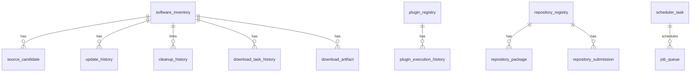

# DATA_MODEL

## 文档目的
定义 Synora 的核心实体、字段约束、关系与状态词汇，为 Repository 与 API 输出提供统一语义。

## 当前状态
- 状态：v1 Frozen（数据模型冻结版）
- 数据域：本地 SQLite + config.json
- 已拍板输入：Discovery MVP 为 Registry-only
- 临时落库基线：`docs/sql/V001__init_schema_draft.sql`

## 上下文输入
- 需要支持：软件发现、来源候选、执行审计、门禁历史
- 需要保证：可追溯、可筛选、可增量扩展

## 预期输出
- 清晰实体清单与字段定义
- 状态词汇一致且可机读
- 与 `docs/API_SPEC.md` 的 JSON 字段一一对应
- 与临时 SQL 草案保持可双向映射

## 临时数据库基线（Draft）
1. 设计说明：`docs/DATABASE_DESIGN_DRAFT.md`
2. 初始化脚本：`docs/sql/V001__init_schema_draft.sql`
3. 任务类型契约：`docs/JOB_TYPES_DRAFT.md`
4. 说明：当前为“暂时性设计”，后续按 migration 演进，不作为冻结 schema。

## 实体定义（Draft）

### 1) `software_inventory`
用途：个人软件库主表（自动发现 + 人工补录统一视图）

字段：
- `id` INTEGER PK
- `name` TEXT NOT NULL
- `version` TEXT NULL
- `publisher` TEXT NULL
- `install_location` TEXT NULL
- `discovery_source` TEXT NOT NULL
- `source_confidence` INTEGER NOT NULL DEFAULT 50
- `first_seen_at` INTEGER NOT NULL
- `last_seen_at` INTEGER NOT NULL
- `is_active` INTEGER NOT NULL DEFAULT 1
- `fingerprint` TEXT NULL

约束：
- `source_confidence` 范围 0-100
- `discovery_source` 枚举：`registry` | `manual`

索引建议：
- `idx_software_name_publisher` (`name`, `publisher`)
- `idx_software_last_seen` (`last_seen_at` DESC)

### 2) `source_candidate`
用途：AI/规则生成的软件来源候选池

字段：
- `id` INTEGER PK
- `software_id` INTEGER NOT NULL FK -> `software_inventory.id`
- `url` TEXT NOT NULL
- `domain` TEXT NOT NULL
- `channel` TEXT NULL
- `confidence` INTEGER NOT NULL
- `reason` TEXT NULL
- `status` TEXT NOT NULL
- `created_at` INTEGER NOT NULL
- `reviewed_at` INTEGER NULL
- `review_note` TEXT NULL

约束：
- `confidence` 范围 0-100
- `status` 枚举：`pending` | `approved` | `rejected`

索引建议：
- `idx_candidate_software_status` (`software_id`, `status`)
- `idx_candidate_confidence` (`confidence` DESC)

### 3) `update_history`
用途：安装/升级/卸载计划与执行历史

字段：
- `id` INTEGER PK
- `software_id` INTEGER NOT NULL FK -> `software_inventory.id`
- `operation` TEXT NOT NULL
- `old_version` TEXT NULL
- `new_version` TEXT NULL
- `requested_mode` TEXT NOT NULL
- `status` TEXT NOT NULL
- `risk_level` TEXT NOT NULL
- `message` TEXT NULL
- `created_at` INTEGER NOT NULL

约束：
- `operation` 枚举：`install` | `upgrade` | `uninstall`
- `requested_mode` 枚举：`dry-run` | `confirm`
- `risk_level` 枚举：`low` | `medium` | `high`

### 4) `cleanup_history`
用途：cleanup quarantine 全链路审计

字段：
- `id` INTEGER PK
- `operation_id` TEXT NOT NULL
- `package_id` TEXT NOT NULL
- `requested_mode` TEXT NOT NULL
- `status` TEXT NOT NULL
- `mutation_boundary_reached` INTEGER NOT NULL
- `rollback_attempted` INTEGER NOT NULL
- `rollback_status` TEXT NOT NULL
- `risk_level` TEXT NOT NULL
- `created_at` INTEGER NOT NULL

约束：
- `status` 枚举：`quarantine_planned` | `quarantine_confirmed` | `quarantine_success` | `quarantine_failed` | `quarantine_rollback_success` | `quarantine_rollback_failed`
- `rollback_status` 枚举：`not_needed` | `success` | `failed`

### 5) `gate_history`
用途：真实变更门禁状态变更记录

字段：
- `id` INTEGER PK
- `timestamp` INTEGER NOT NULL
- `real_mutation_enabled` INTEGER NOT NULL
- `gate_version` TEXT NOT NULL
- `approval_record_ref` TEXT NULL
- `approval_record_present` INTEGER NOT NULL
- `reason` TEXT NOT NULL

### 6) `audit_event`
用途：通用审计事件总线（补充细粒度追踪）

字段：
- `id` INTEGER PK
- `event_type` TEXT NOT NULL
- `actor` TEXT NOT NULL
- `target` TEXT NULL
- `result` TEXT NOT NULL
- `severity` TEXT NOT NULL
- `payload_json` TEXT NULL
- `created_at` INTEGER NOT NULL

### 7) `plugin_registry`（Draft）
用途：插件注册表（安装、签名、信任与启用状态）

字段：
- `id` INTEGER PK
- `plugin_id` TEXT NOT NULL UNIQUE
- `name` TEXT NOT NULL
- `version` TEXT NOT NULL
- `kind` TEXT NOT NULL
- `entry` TEXT NOT NULL
- `runtime` TEXT NOT NULL
- `api_compat` TEXT NOT NULL
- `permissions_json` TEXT NOT NULL
- `actions_json` TEXT NOT NULL
- `signature` TEXT NULL
- `trust_status` TEXT NOT NULL
- `lifecycle_status` TEXT NOT NULL
- `enabled` INTEGER NOT NULL DEFAULT 0
- `installed_at` INTEGER NOT NULL
- `updated_at` INTEGER NOT NULL

约束：
- `kind` 枚举：`source_provider` | `update_policy` | `ai_tool` | `system_tool`
- `runtime` 枚举：`native` | `wasm`
- `trust_status` 枚举：`trusted` | `untrusted` | `blocked`
- `lifecycle_status` 枚举：`discovered` | `installed` | `enabled` | `running` | `disabled` | `blocked`

### 8) `plugin_execution_history`（Draft）
用途：插件调用历史与结果审计

字段：
- `id` INTEGER PK
- `plugin_id` TEXT NOT NULL
- `action` TEXT NOT NULL
- `requested_by` TEXT NOT NULL
- `status` TEXT NOT NULL
- `result_code` INTEGER NOT NULL
- `result_summary` TEXT NULL
- `error_message` TEXT NULL
- `started_at` INTEGER NOT NULL
- `finished_at` INTEGER NULL

约束：
- `status` 枚举：`planned` | `running` | `success` | `failed` | `blocked`
- `result_code` 允许值：`0` | `2` | `3` | `4` | `10`

### 9) `ai_insight_history`（Draft）
用途：AI 分析与推荐历史（可追溯）

字段：
- `id` INTEGER PK
- `insight_type` TEXT NOT NULL
- `input_summary` TEXT NOT NULL
- `result_json` TEXT NOT NULL
- `confidence` INTEGER NOT NULL
- `risk_level` TEXT NOT NULL
- `created_at` INTEGER NOT NULL

约束：
- `insight_type` 枚举：`analyze` | `recommend` | `repair_plan`
- `confidence` 范围 0-100
- `risk_level` 枚举：`low` | `medium` | `high`

### 10) `repair_plan_history`（Draft）
用途：AI 修复方案生命周期记录

字段：
- `id` INTEGER PK
- `target_software` TEXT NOT NULL
- `issue_summary` TEXT NOT NULL
- `plan_steps_json` TEXT NOT NULL
- `rollback_hint` TEXT NULL
- `status` TEXT NOT NULL
- `requested_by` TEXT NOT NULL
- `created_at` INTEGER NOT NULL
- `applied_at` INTEGER NULL

约束：
- `status` 枚举：`repair_planned` | `repair_reviewed` | `repair_applied` | `repair_rejected`

### 11) `job_queue`（Draft）
用途：后台任务队列（扫描/下载/更新/修复执行）

字段：
- `id` INTEGER PK
- `job_type` TEXT NOT NULL
- `payload_json` TEXT NOT NULL
- `priority` INTEGER NOT NULL
- `status` TEXT NOT NULL
- `attempt_count` INTEGER NOT NULL
- `max_attempts` INTEGER NOT NULL
- `scheduled_at` INTEGER NOT NULL
- `started_at` INTEGER NULL
- `finished_at` INTEGER NULL
- `last_error` TEXT NULL
- `created_at` INTEGER NOT NULL

约束：
- `status` 枚举：`queued` | `running` | `success` | `failed` | `retrying` | `deadletter`

### 12) `scheduler_task`（Draft）
用途：定时任务模板（周期性入队）

字段：
- `id` INTEGER PK
- `task_name` TEXT NOT NULL
- `job_type` TEXT NOT NULL
- `cron_expr` TEXT NOT NULL
- `enabled` INTEGER NOT NULL
- `last_enqueued_at` INTEGER NULL
- `next_run_at` INTEGER NULL
- `created_at` INTEGER NOT NULL
- `updated_at` INTEGER NOT NULL

约束：
- `enabled` 取值：0/1

### 13) `download_task_history`（Draft）
用途：下载任务执行历史（含校验结果）

字段：
- `id` INTEGER PK
- `job_id` INTEGER NULL
- `software_id` INTEGER NULL
- `source_url` TEXT NOT NULL
- `target_path` TEXT NOT NULL
- `status` TEXT NOT NULL
- `bytes_total` INTEGER NULL
- `bytes_downloaded` INTEGER NULL
- `checksum_expected` TEXT NULL
- `checksum_actual` TEXT NULL
- `verify_status` TEXT NOT NULL
- `started_at` INTEGER NULL
- `finished_at` INTEGER NULL
- `error_message` TEXT NULL
- `created_at` INTEGER NOT NULL

约束：
- `status` 枚举：`download_queued` | `download_running` | `download_success` | `download_failed`
- `verify_status` 枚举：`not_verified` | `verify_success` | `verify_failed`

### 14) `download_artifact`（Draft）
用途：下载产物索引（可复用与清理）

字段：
- `id` INTEGER PK
- `software_id` INTEGER NULL
- `file_path` TEXT NOT NULL
- `sha256` TEXT NOT NULL
- `size_bytes` INTEGER NOT NULL
- `source_url` TEXT NOT NULL
- `trust_level` TEXT NOT NULL
- `created_at` INTEGER NOT NULL
- `expires_at` INTEGER NULL

约束：
- `trust_level` 枚举：`trusted` | `untrusted` | `unknown`

### 15) `repository_registry`（Draft）
用途：软件仓库注册表（公共/个人/候选）

字段：
- `id` INTEGER PK
- `repo_id` TEXT NOT NULL UNIQUE
- `name` TEXT NOT NULL
- `kind` TEXT NOT NULL
- `source` TEXT NOT NULL
- `trust_status` TEXT NOT NULL
- `enabled` INTEGER NOT NULL DEFAULT 1
- `last_sync_at` INTEGER NULL
- `created_at` INTEGER NOT NULL
- `updated_at` INTEGER NOT NULL

约束：
- `kind` 枚举：`public` | `personal` | `candidate`
- `trust_status` 枚举：`trusted` | `untrusted` | `blocked`

### 16) `repository_package`（Draft）
用途：仓库软件条目索引（`software.yaml` 解析后落库）

字段：
- `id` INTEGER PK
- `package_id` TEXT NOT NULL UNIQUE
- `repo_id` TEXT NOT NULL FK -> `repository_registry.repo_id`
- `name` TEXT NOT NULL
- `version` TEXT NOT NULL
- `publisher` TEXT NULL
- `install_url` TEXT NOT NULL
- `uninstall_command` TEXT NULL
- `check_update_provider` TEXT NOT NULL
- `check_update_ref` TEXT NULL
- `sha256` TEXT NULL
- `risk_level` TEXT NOT NULL
- `source_confidence` INTEGER NOT NULL
- `status` TEXT NOT NULL
- `manifest_yaml` TEXT NOT NULL
- `created_at` INTEGER NOT NULL
- `updated_at` INTEGER NOT NULL

约束：
- `risk_level` 枚举：`low` | `medium` | `high`
- `source_confidence` 范围 0-100
- `status` 枚举：`active` | `deprecated` | `blocked`

### 17) `repository_submission`（Draft）
用途：社区仓库提交与审核记录（Phase 2）

字段：
- `id` INTEGER PK
- `repo_id` TEXT NOT NULL FK -> `repository_registry.repo_id`
- `package_id` TEXT NOT NULL
- `submitted_by` TEXT NOT NULL
- `reason` TEXT NOT NULL
- `status` TEXT NOT NULL
- `review_note` TEXT NULL
- `created_at` INTEGER NOT NULL
- `reviewed_at` INTEGER NULL

约束：
- `status` 枚举：`submitted` | `approved` | `rejected` | `published`

## 关系模型（Draft）
- `software_inventory` 1 -> N `source_candidate`
- `software_inventory` 1 -> N `update_history`
- `software_inventory` 1 -> N `cleanup_history`（通过 `package_id` 或映射字段关联）
- `gate_history` 独立时序表
- `audit_event` 可引用任意对象（弱关联）
- `plugin_registry` 1 -> N `plugin_execution_history`
- `ai_insight_history` 独立时序表
- `repair_plan_history` 独立时序表
- `scheduler_task` 1 -> N `job_queue`（逻辑关联，按 `job_type`/payload 追踪）
- `software_inventory` 1 -> N `download_task_history`
- `software_inventory` 1 -> N `download_artifact`
- `repository_registry` 1 -> N `repository_package`
- `repository_registry` 1 -> N `repository_submission`

## 词汇表（Draft）
1. 风险等级
- `low`：可快速恢复，影响面小
- `medium`：有状态变更，需确认
- `high`：可能导致系统不稳定，必须 confirm + gate

2. 执行模式
- `dry-run`：仅计划与校验，不做真实变更
- `confirm`：进入可执行路径（仍受 gate 约束）

3. 门禁状态
- `enabled`：允许真实变更
- `disabled`：仅允许计划/模拟

4. 插件信任状态
- `trusted`：允许在声明权限内执行
- `untrusted`：仅可查看，不可执行
- `blocked`：被策略封禁

5. 插件运行状态
- `discovered`：已发现未安装
- `installed`：已安装未启用
- `enabled`：可执行
- `running`：执行中
- `disabled`：已禁用

6. AI 洞察类型
- `analyze`：软件整理分析
- `recommend`：场景化安装建议
- `repair_plan`：修复方案建议

7. 任务状态
- `queued`：待执行
- `running`：执行中
- `success`：执行成功
- `failed`：执行失败
- `retrying`：等待重试
- `deadletter`：达到重试上限

8. 下载校验状态
- `not_verified`：未校验
- `verify_success`：校验通过
- `verify_failed`：校验失败

## 迁移策略（Draft）
1. 使用增量 migration 文件（`Vxxx__description.sql`）
2. 新增列优先可空或带默认值
3. 枚举扩展需向后兼容旧记录
4. 破坏性调整必须先写数据迁移脚本

## 数据模型决策（Phase 1 Freeze）
1. `software_inventory` 去重键：采用 `fingerprint(name_norm,publisher_norm,install_location_norm)` 作为主去重依据。
2. `cleanup_history` 关联方案：增加可空 `software_id` 逻辑关联；通过 `package_id -> software_inventory.name` 解析命中后回填，未命中允许保留空值。
3. `audit_event.payload_json`：Phase 1 保持 JSON 单列，不拆结构化列；Phase 2 按查询热点补充投影列。

## ER 图（Mermaid，Phase 1 Freeze）

说明：
1. `audit_event` 与 `gate_history` 为跨域时序审计表，采用弱关联（`target`/`payload_json`）。
2. `cleanup_history` 允许 `software_id` 为空，保证历史兼容与补录可行。

## 数据保留策略（TTL/归档，Phase 1 Freeze）
1. 核心状态表（长期保留）
- `software_inventory`：长期保留，仅软删除/标记 stale。
- `repository_registry`、`repository_package`：长期保留，按状态变更维护。

2. 审计与历史表（分层保留）
- `audit_event`：热数据 180 天；超期归档到 `audit_event_archive`。
- `update_history`、`cleanup_history`、`gate_history`：热数据 365 天；超期归档。
- `plugin_execution_history`、`ai_insight_history`、`repair_plan_history`：热数据 180 天；超期归档。

3. 队列与下载表（短周期）
- `job_queue`：`success`/`failed`/`deadletter` 保留 90 天；到期归档或清理。
- `download_task_history`：保留 90 天。
- `download_artifact`：按 `expires_at` 清理；若被活跃记录引用则延迟删除。

4. 归档规则
- 归档必须保留主键、时间戳、状态、关键上下文字段。
- 归档作业必须写审计事件（批次号、影响行数、失败原因）。

## 性能基线（Phase 1 Freeze）
1. 规模假设（MVP）
- `software_inventory`：1k-10k 行
- `source_candidate`：10k-100k 行
- `audit_event`：100k-1M 行

2. 查询目标（SQLite 本地）
- 常用列表查询 P95 < 200ms（limit<=100）
- 审计摘要查询 P95 < 300ms
- 单次 discover/upsert 批处理（1k 记录）< 2s

3. 索引基线
- `software_inventory(name, publisher)`、`software_inventory(last_seen_at)`
- `source_candidate(software_id, status)`、`source_candidate(confidence)`
- `audit_event(created_at)`、`audit_event(event_type, created_at)`
- `job_queue(status, priority, scheduled_at)`
- `download_task_history(status, created_at)`

4. 退化保护
- 所有列表接口默认 `--limit`，避免全表扫描返回。
- `payload_json` 查询只用于追溯，不作为高频筛选字段。

## 更新规则
- 字段或状态词汇变更必须同步：
  - `docs/API_SPEC.md`
  - `docs/ARCHITECTURE.md`
  - `logs/DEVELOPMENT_LOG.md`
- 当前为 Draft，可调整，不视为冻结 schema。
